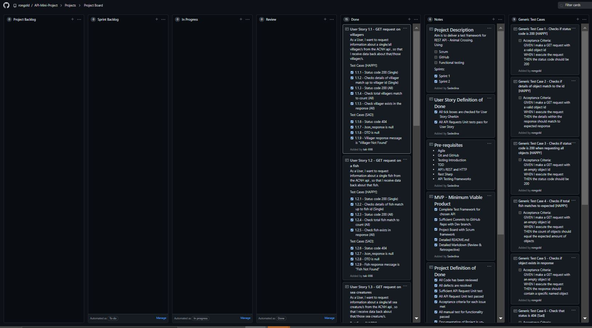

# **API Testing Mini Project Review** 

## Contents

  * [Project Description](#project-description)
  * [Tools:](#tools-)
  * [Methodology:](#methodology-)
  * [MVP - Minimum Viable Product](#mvp---minimum-viable-product)
  * [Project Definition of Done](#project-definition-of-done)
- [Sprint 1](#sprint-1)
    + [Team](#team)
    + [Choosing API Framework to create](#choosing-api-framework-to-create)
    + [Kanban Board at the start](#kanban-board-at-the-start)
    + [Kanban Board in the middle](#kanban-board-in-the-middle)
    + [Kanban Board at the end](#kanban-board-at-the-end)
    + [Sprint Achievement](#sprint-achievement)
    + [Sprint Retrospective](#sprint-retrospective)
- [Sprint 2](#sprint-2)
    + [Kanban Board at the start](#kanban-board-at-the-start-1)
    + [Kanban Board at the end](#kanban-board-at-the-end-1)
    + [Sprint Achievement](#sprint-achievement-1)
    
    * [Sprint Retrospective](#sprint-retrospective-1)
- [Sprint Project Retrospective](#sprint-project-retrospective)
  * [Application pages](#application-pages)
- [In Conclusion](#in-conclusion)

#### Project Description

Create a test framework for the RESTful API from Animal Crossing: New Horizons -  (ACNH API)

 [Animal Crossing API](http://acnhapi.com/doc)

#### Tools:

- Git and GitHub

- Visual Studio

  - RestSharp

  - Newtonsoft.Json
  - NUnit

- Postman

- Discord

#### Methodology:

* Scrum & Agile
* Testing Driven Development (TDD)

#### MVP - Minimum Viable Product

- Complete Test Framework for chosen API
- Sufficient Commits to GitHub Repo with Dev branch.
- Project Board with Scrum framework
- Detailed README.md
- Detailed Markdown (Review & Retrospective)

#### Project Definition of Done

1. All Code has been reviewed
2. All defects are resolved
3. Sufficient API Request Unit test
4. All API Request Unit test passed
5. Acceptance criteria for each issue met
6. All manual test for functionality passed
7. Documentation of Project is up-to-date

### Sprint 1

[Friday]

##### Team

The Team is composed of three individuals: Ronil Goldenwalla, Tak Li and Samuel Adedina.

##### Choosing API Framework to create

At the start of Sprint 1, simple discussion to understand the teams interest on what API framework to create. An API that allows to 'GET' information and cross-check it back with the server.

After looking at the comprehensive list of [API's](https://github.com/public-apis/public-apis)

Animal Crossing was chosen due to the respective admiration and nostalgic feeling for the game.

##### Kanban Board at the start

##### Kanban Board in the middle

##### Kanban Board at the end

##### Sprint Achievement

In this sprint, we manage to 

- Set-up the GitHub collaboratively.
- Set-up essential classes for API Framework
  * Data Handling - DTO, IResponse, Model
  * HTTP Manager - Service layer
  * Tests - Happy path and Sad path

##### Sprint Retrospective

### Sprint 2

[Monday]

##### Kanban Board at the start

##### Kanban Board at the end

##### Sprint Achievement

In this sprint, we manage to 

- Refactor the Model
- Added more tests
  * Tests - Happy path and Sad path

### Sprint Retrospective

##### Mood: 9/10

##### Time Management: 4/5

#####  Work load: 2/5

##### Blockers: 0/5

------------------------

### Sprint Project Retrospective

##### Mood: 8/10

##### Time Management: 4/5

#####  Work load: 3/5

##### Blockers: 1/5

-------------------------------

### In Conclusion

| What we learnt                 | What to do for next time                            |
| ------------------------------ | --------------------------------------------------- |
| How to collaborate with others | Test for the API Headers                            |
| Effectively solve blockers     | Pick an API with POST (Maybe PUT or DELETE) as well |
| Test APIs                      |                                                     |

