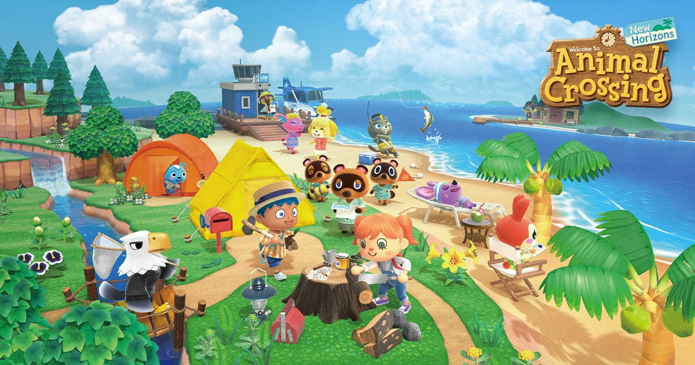

# API-Mini-Project

#### Introduction - Project Description

This GitHub repository consists of files for a test API Framework for Animal Crossing: New Horizons - ([ACNH - API](http://acnhapi.com/doc))  

Users can check the tests of the API framework and see if it passes, to see

------

### Download Visual Studio

Follow instruction on documentation to download latest [Visual Studio](https://docs.microsoft.com/en-us/visualstudio/install/install-visual-studio?view=vs-2019).

This Framework was built with Visual Studio 2019 and may operate differently according to the version you are using.

### Clone Repository 

1. On GitHub, navigate to the main page of the repository

2. Above the list of files, click **Code**.

3. To clone the repository using HTTPS, under "Clone with HTTPS", click copy button 

   or copy the Github link shown.

   

4. Open the folder where you want to save the cloned repository.

   

5. Type "cmd" in the file directory and press ENTER.

6. In the console panel (that opened) type "git clone " + the link of the cloned repository copied and press ENTER.

   

### Set up Visual Studio

1. Open the folder: "API-Mini-Project"

2. Open the folder: "API_Mini_Solution"

3. Open the application: "API_Mini_Solution.sln"

4. In Search bar type "Solution Explorer" and press Enter

   Check "Tests" and  "AnimalCrossingIOService" folder are present

   

5. Click on the "Build" tool option on the top

   On the drop down click on the "Clean Solution"

   Proceed to click on the "Rebuild Solution"

   

   

### Run Tests

1. Click on "Test Explorer" on the bottom of Visual Studio

2. Click on the Run button

   Check all tests passed

   

   
